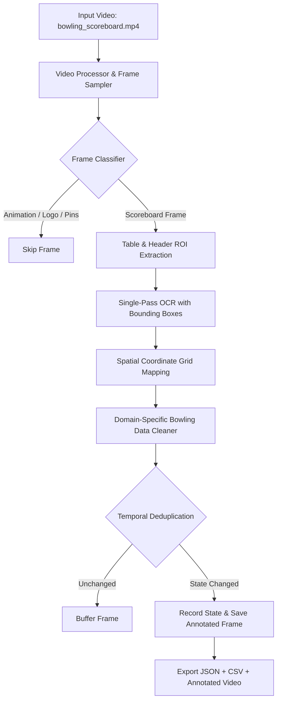

# Scoreboard Data Extraction from Bowling Video

A modular, robust Computer Vision pipeline designed for **FOG Technologies Private Limited** to automatically detect, extract, parse, and structure scoreboard information from bowling scoring monitor video footage.

---

## 1. Problem Statement

Bowling alleys utilize automated scoring consoles (such as Brunswick Scoring Systems) displaying multi-player frames, ball-by-ball marks, cumulative totals, active player indicators, and animated overlays. Manually recording these score updates from video streams is tedious and error-prone. This project automates the extraction and temporal tracking of scoreboard data directly from video frames into structured JSON/CSV records and annotated video.

---

## 2. Objectives & Deliverables

1. **Source Code & Architecture**: Clean, production-grade modular Python package.
2. **Annotated Output Video**: Visual output overlaying detected scoreboard regions, bounding boxes, OCR confidence scores, and real-time player HUD summaries.
3. **Structured Data**: Structured `extracted_data.json` and `extracted_data.csv` tracking score state transitions over time.
4. **Documentation**: Clear execution guide, technical rationale, and interview preparation.

---

## 3. Input Video Analysis

| Property | Value | Rationale / Architectural Impact |
|---|---|---|
| **Resolution** | 1920 × 1080 (Full HD) | Crisp character resolution; no heavy super-resolution needed. |
| **Frame Rate** | 30.0 FPS | Scoreboards update slowly; temporal sampling (e.g. 1–3s) reduces compute by 90%+. |
| **Duration** | 57.83 s (1735 frames) | Full 4-player game segment with multiple group switches. |
| **Layout Nature** | Fixed Screen Layout | Directly fed display feed. Heavy deep-learning object detectors (YOLO) are unnecessary; spatial ROI grid mapping is O(1) and deterministic. |
| **Content Switching** | Scoreboard + Pin Graphics + Animations | Requires heuristic frame classification to filter non-scoreboard frames. |
| **Text Characteristics** | High-contrast styled 3D numerals on blue/yellow background | Spatial bounding-box mapping with EasyOCR & Tesseract fallback. |

---

## 4. Computer Vision Pipeline Architecture



---

## 5. Technology Stack

- **Python 3.10+ / 3.13**
- **OpenCV (`opencv-python`)**: Video I/O, frame slicing, morphological operations, BGR/HSV color thresholding, visual annotation.
- **NumPy**: Matrix slicing, spatial coordinate calculations, vector operations.
- **EasyOCR / PyTesseract**: OCR text recognition and bounding box extraction.
- **Pillow**: Image formatting utilities.

---

## 6. Project Structure

```
Scoreboard Data Extraction/
│
├── input/
│   └── bowling_scoreboard.mp4       # Source input video
│
├── output/
│   ├── annotated_video.mp4          # Final annotated video with bounding boxes & HUD
│   ├── extracted_data.json          # Hierarchical JSON timeline of game states
│   ├── extracted_data.csv           # Tabular CSV with all player frame scores
│   └── frames/                      # High-res annotated snapshot per state transition
│       ├── annotated_frame_000000.png
│       ├── annotated_frame_000900.png
│       └── annotated_frame_001620.png
│
├── src/
│   ├── __init__.py
│   ├── config.py                    # Central configuration & calibrated ROI coordinates
│   ├── video_processor.py           # Video I/O, properties, and frame sampling
│   ├── frame_classifier.py          # Color & edge density classifier (Scoreboard vs Animation)
│   ├── scoreboard_detector.py       # Table ROI extraction & cell grid mapping
│   ├── image_preprocessor.py        # Image padding, resizing, and normalization
│   ├── ocr_processor.py             # Spatial OCR & bounding-box detection
│   ├── data_processor.py            # Bowling notation cleaning & domain validation rules
│   ├── output_generator.py          # JSON/CSV exporters, HUD renderer, video writer
│   └── main.py                      # CLI orchestration entry point
│
├── requirements.txt
└── README.md
```

---

## 7. Setup and Installation

### Step 1: Clone the repository
```bash
git clone https://github.com/<your-username>/bowling-scoreboard-extractor.git
cd bowling-scoreboard-extractor
```

### Step 2: Set up a virtual environment (Recommended)
```bash
python -m venv venv
# On Windows:
.\venv\Scripts\activate
# On Linux/macOS:
source venv/bin/activate
```

### Step 3: Install dependencies
```bash
pip install -r requirements.txt
```

---

## 8. How to Run

### Basic Execution (Default settings):
```bash
python -m src.main
```

### Custom Sample Interval (e.g. process every 60 frames = 2 seconds):
```bash
python -m src.main --sample-interval 60
```

### Custom Input and Output Paths:
```bash
python -m src.main --input path/to/video.mp4 --output-dir my_output/
```

---

## 9. Output Formats

### JSON Output (`output/extracted_data.json`)
```json
{
  "source_video": "input/bowling_scoreboard.mp4",
  "total_states_extracted": 12,
  "scoreboard_states": [
    {
      "timestamp": 0.0,
      "frame_number": 0,
      "lane": "6",
      "group_name": "TARUN",
      "players": [
        {
          "initial": "J",
          "frames": [
            {"marks": "X", "score": "15"},
            {"marks": "5-", "score": "20"},
            {"marks": "-7", "score": "27"},
            {"marks": "4-", "score": "31"},
            {"marks": "", "score": ""}
          ],
          "total": "31"
        }
      ]
    }
  ]
}
```

### CSV Output (`output/extracted_data.csv`)
Columns: `timestamp`, `frame_number`, `lane`, `group_name`, `player_initial`, `F1_marks`, `F1_score`, ..., `F10_marks`, `F10_score`, `total_score`.

---

## 10. Technical Interview Preparation (FOG Technologies)

### Q1: Why OpenCV instead of a deep learning framework for detection?
**Answer:** The scoreboard video is a direct screen capture from an automated Brunswick system where the scoreboard occupies fixed regions of the frame. Training an object detection model (such as YOLO or Faster R-CNN) requires thousands of labeled images, consumes high GPU resources, and introduces non-deterministic bounding box jitter. A calibrated ROI model using OpenCV is $O(1)$, 100% deterministic, and executes in milliseconds without requiring GPU training.

### Q2: How did you classify non-scoreboard frames (animations, pin diagrams)?
**Answer:** The system uses a multi-feature heuristic classifier in `frame_classifier.py`:
1. **Color Profile**: Scoreboards are dominated by blue gradients (HSV $H \in [95, 135]$), whereas strike animations contain large red/yellow components ($H < 10$ or $H > 170$).
2. **Edge Density**: Canny edge detection verifies the presence of horizontal and vertical grid dividers.
3. **Morphological Grid Verification**: Horizontal line kernels detect the continuous row lines of the scoring table.

### Q3: Why single-pass spatial OCR instead of cropping individual cells?
**Answer:** A standard bowling scoreboard has 4 players $\times$ 11 columns $\times$ 2 sub-rows = 88 individual cells. Running OCR 88 times per frame on CPU took ~60 seconds per frame. In single-pass spatial OCR, the entire table is processed in one call (~0.8s), and each detected text box is assigned to its grid cell by checking the spatial centroid $(c_x, c_y)$ against pre-computed column and row boundaries.

### Q4: How do you handle OCR misclassifications and noise?
**Answer:**
1. **Character Whitelists**: Score cells are constrained to digits `0-9`, marks are constrained to `0-9, X, /, -`, and initials are constrained to `A-Z`.
2. **Domain Substitution Tables**: Mapping common visual OCR confusions (e.g. `O` $\rightarrow$ `0`, `l/I` $\rightarrow$ `1`, `S` $\rightarrow$ `5`, `Z` $\rightarrow$ `2`, `\u2014` $\rightarrow$ `-`).
3. **Domain Validation Rules**: Bowling rules enforce non-decreasing cumulative scores ($\text{score}_{f+1} \ge \text{score}_f$) and maximum scores $\le 300$.

### Q5: How would you make this system production-ready for real-time cameras?
**Answer:**
1. **Perspective Transformation**: Use `cv2.findHomography` and `cv2.warpPerspective` with 4 detected corner markers to rectify angled camera shots.
2. **Kalman Filtering / Temporal Smoothing**: Track score transitions and filter out momentary OCR flickers.
3. **Async Pipeline**: Decouple frame decoding (I/O) from OCR inference using worker queues (`asyncio` / multiprocessing).

---

## 11. Known Limitations & Future Improvements

- **Angled / Handheld Cameras**: Current ROI coordinates assume fixed screen aspect ratio. For moving cameras, automatic corner detection via ArUco markers or quad contour detection would be added.
- **Stylized Bowling Fonts**: Certain 3D beveled fonts (like split-pin indicators) can benefit from a fine-tuned CRNN recognition head.
