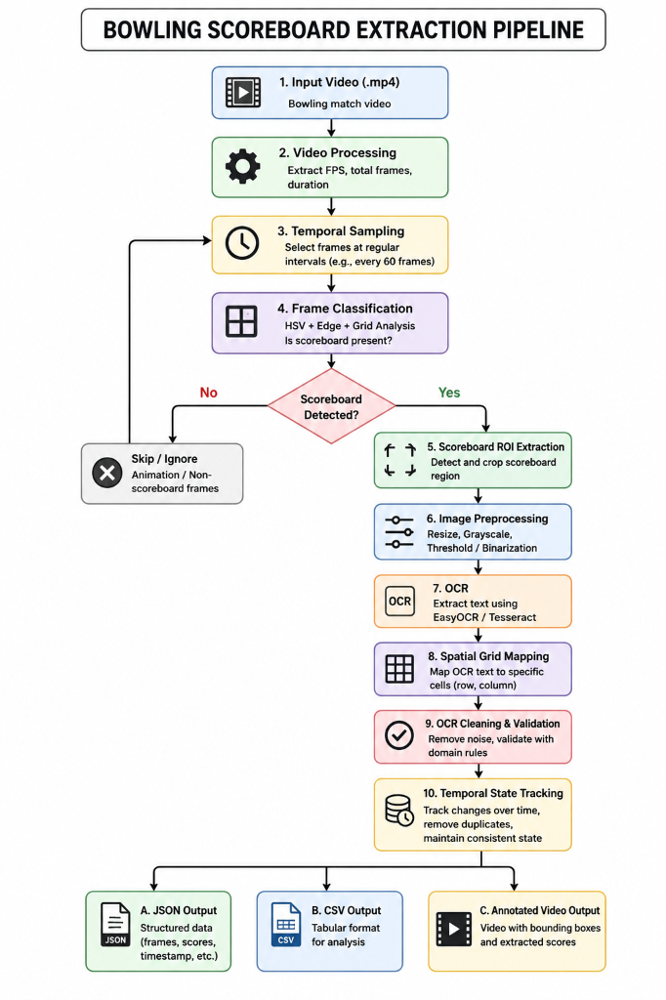

# 🎳 Bowling Scoreboard Data Extraction

### Computer Vision Engineer – Round 1 | FOG Technologies

A Computer Vision + OCR pipeline that extracts structured bowling scoreboard data from video.

The system detects scoreboard frames, extracts player/frame information, validates OCR results, tracks score changes, and generates structured **JSON/CSV data** with an **annotated output video**.

---

## 🎯 Problem

Bowling scoring screens continuously display:

* Players and initials
* Frames
* Strike (`X`)
* Spare (`/`)
* Miss (`-`)
* Frame scores
* Total scores
* Lane/group information

The video also contains animations and non-scoreboard frames.

The goal is to automatically identify valid scoreboard frames and convert the displayed information into structured data.

---

# 🔄 Solution Pipeline

```text
Input Video
     ↓
Frame Sampling
     ↓
Frame Classification
     ↓
Scoreboard ROI
     ↓
Image Preprocessing
     ↓
OCR
     ↓
Spatial Grid Mapping
     ↓
OCR Cleaning & Validation
     ↓
Temporal State Tracking
     ↓
 ┌──────────┬──────────┬──────────────┐
 ↓          ↓          ↓
JSON       CSV     Annotated Video
```

### 📌 Architecture Flowchart
## 📐 System Architecture
# 📐 System Architecture


# 🎥 Input Video

The provided bowling scoreboard video is used as the input.

| Property   |            Value |
| ---------- | ---------------: |
| Resolution |      1920 × 1080 |
| FPS        |               30 |
| Duration   |       ~57.83 sec |
| Frames     |            ~1735 |
| Layout     | Fixed scoreboard |

### Input Screenshot

**Add screenshot:**

```text
docs/screenshots/01_input_frame.png
```

```markdown

```

---

# 🛠️ Technology Stack

* **Python** – Core implementation
* **OpenCV** – Video processing and Computer Vision
* **NumPy** – Image/matrix operations
* **EasyOCR** – Text detection and recognition
* **PyTesseract** – OCR fallback
* **Pillow** – Image utilities
* **JSON / CSV** – Structured output

---

# 📂 Project Structure

```text
bowling-scoreboard-extractor/
│
├── input/
│   └── bowling_scoreboard.mp4
│
├── output/
│   ├── annotated_video.mp4
│   ├── extracted_data.json
│   ├── extracted_data.csv
│   └── frames/
│
├── docs/
│   ├── architecture/
│   │   └── flowchart.png
│   └── screenshots/
│       ├── 01_input_frame.png
│       ├── 02_code_running.png
│       ├── 03_scoreboard_detection.png
│       ├── 04_ocr_output.png
│       └── 05_final_output.png
│
├── src/
│   ├── config.py
│   ├── video_processor.py
│   ├── frame_classifier.py
│   ├── scoreboard_detector.py
│   ├── image_preprocessor.py
│   ├── ocr_processor.py
│   ├── data_processor.py
│   ├── output_generator.py
│   └── main.py
│
├── requirements.txt
└── README.md
```

---

# ⚙️ Installation

### 1. Clone Repository

```bash
git clone https://github.com/<your-username>/bowling-scoreboard-extractor.git
cd bowling-scoreboard-extractor
```

### 2. Create Virtual Environment

**Windows:**

```bash
python -m venv venv
.\venv\Scripts\activate
```

**Linux/macOS:**

```bash
python3 -m venv venv
source venv/bin/activate
```

### 3. Install Dependencies

```bash
pip install -r requirements.txt
```

---

# ▶️ Run

### Default

```bash
python -m src.main
```

### Custom Sampling

```bash
python -m src.main --sample-interval 60
```

At 30 FPS, 60 frames ≈ 2 seconds.

### Custom Input/Output

```bash
python -m src.main \
    --input path/to/video.mp4 \
    --output-dir output/
```

---

# 🧠 How It Works

## 1. Frame Sampling

The video runs at 30 FPS, but processing every frame is unnecessary.

Selected frames are processed at a configurable interval to reduce OCR computation.

---

## 2. Frame Classification

The system filters out animation/non-scoreboard frames using:

* HSV color profile
* Edge density
* Scoreboard grid structure

Only likely scoreboard frames are passed to OCR.

### Visual Evidence

```text
docs/screenshots/02_code_running.png
```

---

## 3. Scoreboard Detection

Since the provided scoreboard has a **fixed layout**, calibrated ROI coordinates are used.

This avoids unnecessary object-detection models and provides fast, deterministic extraction.

### Visual Evidence

```text
docs/screenshots/03_scoreboard_detection.png
```

```markdown

```

---

## 4. Image Preprocessing

The detected scoreboard is prepared for OCR using operations such as:

```text
Resize
  ↓
Grayscale
  ↓
Contrast Enhancement
  ↓
Thresholding
  ↓
OCR
```

---

## 5. OCR

EasyOCR detects text along with bounding boxes and confidence scores.

Instead of running OCR separately on every cell, the scoreboard region is processed and detected text is mapped to the corresponding grid cell.

```text
OCR Detection
     ↓
Bounding Box
     ↓
Centroid (cx, cy)
     ↓
Row + Column
     ↓
Scoreboard Cell
```

### Visual Evidence

```text
docs/screenshots/04_ocr_output.png
```

```markdown

```

---

## 6. OCR Cleaning & Validation

Common OCR errors are corrected contextually:

```text
O → 0
I/l → 1
S → 5
Z → 2
— → -
```

Extracted scores are also checked against bowling rules.

Examples:

```text
0 ≤ score ≤ 300
```

and cumulative scores should not decrease between frames.

---

## 7. Temporal State Tracking

The same scoreboard state can appear across multiple frames.

The system compares the current state with the previous valid state and records only meaningful changes.

```text
Same State
    ↓
Ignore Duplicate

Changed State
    ↓
Save New State
```

---

# 📤 Output

The system generates:

```text
output/
│
├── extracted_data.json
├── extracted_data.csv
├── annotated_video.mp4
└── frames/
```

### JSON

Stores hierarchical scoreboard information:

```json
{
  "timestamp": 0.0,
  "frame_number": 0,
  "lane": "6",
  "group_name": "TARUN",
  "players": [
    {
      "initial": "J",
      "total": "31"
    }
  ]
}
```

### CSV

Contains tabular information such as:

```text
timestamp
frame_number
lane
group_name
player_initial
F1_marks
F1_score
...
F10_marks
F10_score
total_score
```

---

# 🎥 Annotated Video

The final video visually demonstrates:

* Scoreboard ROI
* Grid boundaries
* OCR bounding boxes
* Detected text
* OCR confidence
* Extracted scoreboard information

### Demo Video

**Add your demo video link here:**

```text
[Demo Video](YOUR_GOOGLE_DRIVE_OR_YOUTUBE_LINK)
```

### Recommended Demo Flow

```text
Input Video
    ↓
Run Project
    ↓
Scoreboard Detection
    ↓
OCR Extraction
    ↓
Final JSON / CSV
    ↓
Annotated Video
```

---

# 📸 Documentation Evidence

The assessment requires screenshots showing the working solution.

| Screenshot                    | What it should show         |
| ----------------------------- | --------------------------- |
| `01_input_frame.png`          | Original scoreboard frame   |
| `02_code_running.png`         | Project running in terminal |
| `03_scoreboard_detection.png` | ROI + grid detection        |
| `04_ocr_output.png`           | OCR boxes + detected text   |
| `05_final_output.png`         | JSON/CSV final result       |

These screenshots can be included in the assessment PDF.

---

# ❓ Key Technical Decisions

### Why OpenCV instead of YOLO?

The scoreboard has a fixed and predictable layout. A calibrated ROI approach is therefore faster and simpler than training a general-purpose object detector.

If the camera position becomes variable, automatic detection or a deep-learning detector can be introduced.

### Why OCR only selected frames?

OCR is computationally expensive. Frame sampling and classification reduce unnecessary OCR calls.

### Why spatial OCR?

Processing the complete scoreboard once and mapping OCR bounding boxes to cells avoids running OCR independently on every cell.

---

# ⚠️ Limitations

The current implementation assumes:

* Fixed/known scoreboard layout
* Reasonably clear video
* Limited perspective distortion
* Consistent scoreboard design

Moving cameras and highly angled views would require automatic perspective correction.

---

# 🚀 Future Improvements

* Automatic scoreboard detection
* Perspective correction using homography
* Temporal/Kalman filtering
* Adaptive frame sampling
* Real-time camera support
* Improved OCR model for stylized fonts
* Automatic support for multiple scoreboard layouts

---

# 📦 Deliverables

This project provides all three required assessment deliverables:

### 1. GitHub Repository

Contains complete source code and documentation.

### 2. Demo Video

Shows:

```text
Input → Code → Detection → OCR → Final Output
```

### 3. Documentation PDF

Contains screenshots of:

```text
Input
Code Execution
Scoreboard Detection
OCR
Final Output
```

---

# 👩‍💻 Candidate

**Khushi Pal**

**Role:** Computer Vision Engineer

**Assessment:** Round 1 – FOG Technologies

---

## ⭐ Summary

The system converts bowling scoreboard video into structured data using:

**OpenCV + OCR + Spatial Mapping + Domain Validation + Temporal Tracking**

The approach is lightweight, explainable, and designed specifically for the fixed-layout scoreboard provided in the assessment.
